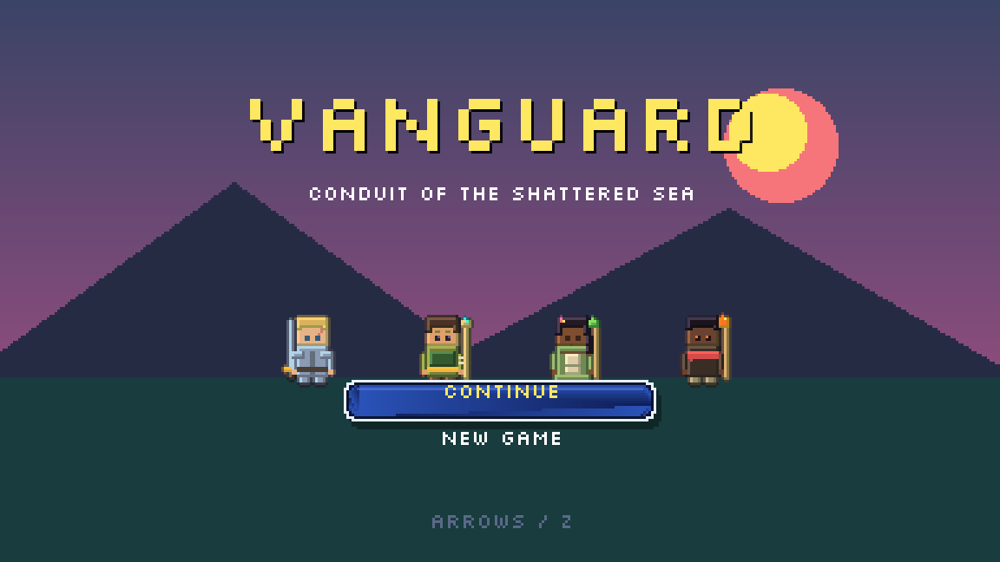
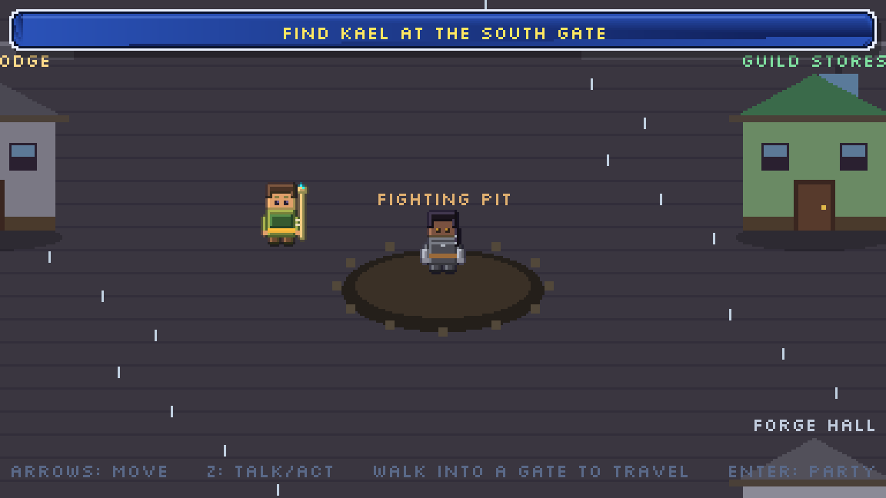
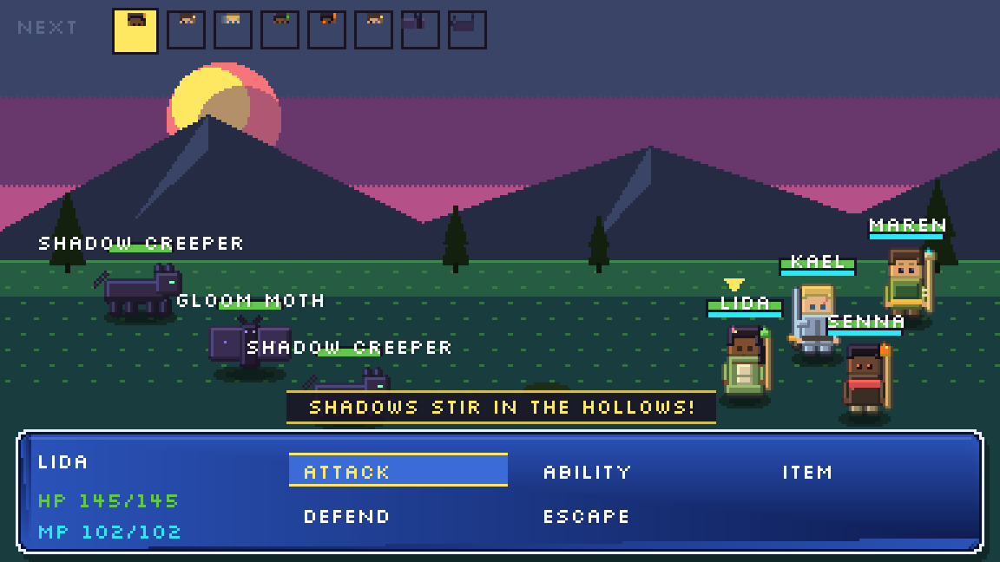
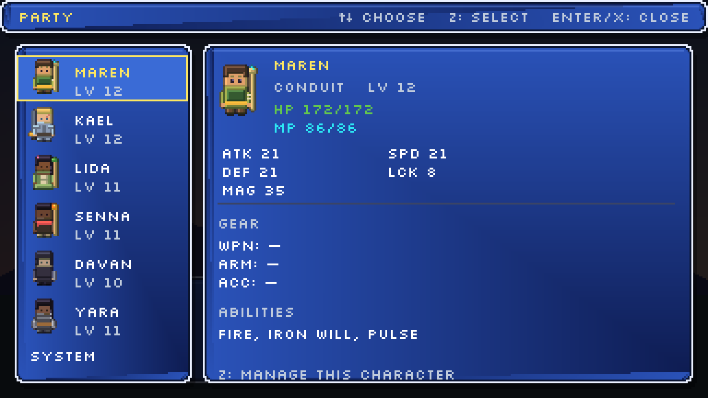

# Vanguard



> **Conduit of the Shattered Sea** — a GBA/SNES-era turn-based JRPG built in the browser.


**Vanguard** is a hand-built turn-based RPG inspired by *Final Fantasy IV/V*, *Golden Sun*, and
the GBA Tactics era. It runs entirely in the browser on **TypeScript + Phaser 3 + Vite**, with
every sprite, tile, and chiptune track generated procedurally in code — no art assets, no audio
files. It's a web port of the Godot "Vanguard" project, built so the visuals can be iterated on
directly in a browser preview.

You play **Maren**, a support-focused "Conduit" who amplifies the latent power of his allies.
Beginning in the magic-less border village of Thornwall, you gather a party and cross the shattered
continent of **Aethara** to confront the Archon who is draining the world of magic.

---

## Screenshots

| Connected overworld | Turn-based battle | Party & status menu |
| --- | --- | --- |
|  |  |  |

---

## Table of contents
- [Features](#features)
- [Controls](#controls)
- [Gameplay systems](#gameplay-systems)
- [World & cast](#world--cast)
- [Getting started](#getting-started)
- [Balance simulator](#balance-simulator)
- [Architecture & tech notes](#architecture--tech-notes)
- [Project layout](#project-layout)
- [Roadmap](#roadmap)

---

## Features

- **Connected, walkable world** — regions are linked by gates that unlock as the story
  progresses (FF4 / Golden Sun style). There is no level-select menu: you walk the whole world,
  and you can backtrack freely to grind, shop, or rest.
- **Flag-driven story beats** — cutscenes, recruitments, and forced fights trigger *in place*
  when you reach a spot or talk to an NPC, rather than via a linear scene machine.
- **Classic-JRPG combat** — physical/magical damage formulas, elemental weaknesses & resistances,
  buffs/debuffs and damage-over-time, critical hits, a tick-rate turn queue, and **boss phase
  changes** at half health.
- **Mechanic-driven bosses** — each major boss is a puzzle, not just a stat wall: **The Mirror**
  *reflects* magic back at the caster (fight it with fire), **Rhogar** builds compounding *rage*
  once wounded, and the **Hollow Stalker** charges a telegraphed *pressure* burst you must brace for.
- **The Conduit system** — Maren doesn't cast spells; he *amplifies* allies. The **Conduit Pulse**
  is a free support action, and each ally's **Bond (BND)** stat scales how effective Maren's
  support is on them.
- **Random encounters** in the wilderness, plus **visible nodes** for optional treasure-guardians
  and scripted boss fights.
- **Real, enterable towns** — four hub towns (Thornwall, Waystation, Redhollow, Ironhold) with
  walkable interiors: consumable shops, equipment shops, homes, a clinic, and **inns**.
- **Persistent HP/MP & resting** — wounds and spent MP carry between fights. Rest for free at
  Maren's mother's clinic in Thornwall, or pay an innkeeper in later towns. A KO'd ally stays
  down until revived or rested.
- **Marks economy** — earn currency from battles and bounties; spend it on items, gear, and rest.
- **Repeatable bounty quest** — Farmer Bram pays you to thin out the wildlife in a starter
  grinding field; the target creature rotates each time.
- **Interactive party menu** — inspect stats, equip/unequip gear from a shared stash, browse
  skills and class info, **save the game**, or return to the title — accessible from anywhere,
  including inside shops.
- **Procedural everything** — sprites baked from code, FF-style gradient UI windows, a Silkscreen
  pixel font, and a Web Audio chiptune soundtrack with per-area tracks.
- **Headless balance simulator** that re-runs the *real* combat engine to report difficulty bands
  by party level — so encounters are tuned with data, not vibes.
- **Saves to `localStorage`** with an in-menu save option.

## Controls

| Key | Action |
| --- | --- |
| **Arrow keys** | Move / navigate menus |
| **Z** | Confirm · talk · interact · attack |
| **X** | Cancel · back |
| **Enter** | Open the party menu (works in towns, interiors, the field, and shops) |
| **M** | Toggle mute |

## Gameplay systems

### Combat
Turn order is driven by a **tick-rate queue** (a unit's turn comes up every `100 / SPD` ticks, so
faster units act more often). Physical damage is `ATK × power − DEF`; magical damage is
`MAG × power − (DEF×0.3 + MAG×0.3)`, modified by elemental weaknesses, resistances, immunities,
and absorptions. Statuses cover stat buffs/debuffs, stun, silence, poison/DoT, and regen. Bosses
flip into a more dangerous **phase 2** at 50% HP, and carry a signature **gimmick** that turns the
fight into a puzzle:

- **Reflect** (The Mirror) — bounces a share of *magical* damage back onto the caster, unless the
  hit uses an element it's weak to. Raw nukes punish you; fire and light pass straight through.
- **Rage** (Rhogar) — once driven below half HP, he compounds his ATK every turn up to a cap, a
  soft enrage clock that rewards finishing fast.
- **Pressure** (Hollow Stalker) — charges over several turns, telegraphs on the last one, then
  unleashes a heavy party-wide burst and resets. Guard the hit or race to interrupt it.

The mechanics live in the real combat engine (`src/combat.ts`) and are exercised head­less by the
balance sim (`sim/sim.ts`) and a focused regression test (`sim/mech_test.ts`).

### The Conduit
Maren is an **Amplifier**: instead of dealing damage, he empowers the party through the Conduit
Pulse (a free action) and support abilities. Each ally carries a **Bond (BND)** stat that grows
through story events, bond quests, and level-ups, and determines how strongly Maren's support
lands on them. The series' antagonist is an **Absorber** — Maren's mirror image — who drains magic
rather than giving it.

### Exploration & difficulty
The world is **one continuous, backtrackable map** gated by story flags. Difficulty follows a
**Classic-JRPG** philosophy: there is **no level floor**. Skip too many fights and you'll hit a
wall — so grinding the field, learning a boss's mechanic, or coming back better-geared is part of
the loop.

### Towns, economy & resting
Each town has enterable buildings. Shops trade in **Marks**; the party menu manages a shared
equipment stash. **HP/MP persist between battles**, so resting matters: the Thornwall clinic is
free (Maren's mother runs it), while inns in later towns charge a fee that scales with the town.

## World & cast

The continent of **Aethara** was shattered two centuries ago by a Conduit who lost control of his
power, leaving six regions scattered around a central **Shattered Sea**:

| Region | Flavor |
| --- | --- |
| **Thornwall** | The magic-less border village where Maren begins. |
| **Waystation** | A fortified rest stop on the south road through the wilds. |
| **Redhollow** | A fire-region town living under Valcrest occupation. |
| **The Hollows** | Dark, nomadic woodland prowled by shadow-creatures. |
| **Ironhold** | A guild-meritocracy city built around its fighting pit. |
| **Frosthollow** | An ice theocracy (later in the journey). |

**The party** (joins in story order):

| Member | Class | Role |
| --- | --- | --- |
| **Maren** | Conduit | Amplifier — empowers allies and channels the Lattice through bonds. |
| **Kael** | Knight | Front-line guardian; heavy armor, holds the line. |
| **Lida** | White Mage | Healer and warder. |
| **Senna** | Black Mage | Elemental artillery at range. |
| **Davan** | Thief | Swift striker — speed, evasion, opportunistic blades. |
| **Yara** | Monk | Bare-fist bruiser — raw power and relentless pressure. |

## Getting started

```bash
npm install
npm run dev      # Vite dev server on http://localhost:5173
```

Open the printed URL in a browser. On Windows you can also double-click **`play.bat`** to launch
the game in its own window.

```bash
npm run build    # type-check + production bundle into dist/
npm run preview  # serve the production build
```

## Balance simulator

The simulator imports the **real** combat code (`src/combat.ts` + `src/data.ts`) and runs scripted
fights across a range of party levels, reporting each encounter as a difficulty band
(TRIVIAL / fair / RISKY / BRUTAL / wall). This is how enemy and boss stats are tuned.

```bash
node_modules/.bin/esbuild sim/sim.ts --bundle --platform=node --outfile=sim/out.cjs && node sim/out.cjs
```

## Architecture & tech notes

- **Rendering** — there are no image files. `src/sprites.ts` draws each sprite with a small pixel
  DSL and bakes it to a `CanvasTexture` at boot; UI uses an FF-style blue-gradient window helper.
  Everything renders at a crisp **384×216** internal resolution, scaled up with nearest-neighbor.
- **Scenes** — `Title → Overworld → Battle / Dialogue / PartyMenu / Shop`, wired through Phaser's
  scene manager. Overlays (dialogue, menu, shop) `launch + pause` the scene beneath them and
  resume it on close.
- **World as data** — `src/story.ts` holds the world graph: `WORLD_GATES` (region links + unlock
  conditions), `WORLD_BEATS` (every dialogue/battle trigger with its firing condition), the party
  roster, persistent HP/MP, the equipment stash, currency, inventory, and save/load.
- **Audio** — `src/audio.ts` synthesizes chiptune music and SFX live with the Web Audio API
  (oscillators + filtered-noise percussion); it resumes on the first user gesture.

## Project layout

```
src/
  main.ts            Phaser bootstrap + scene list + global input (mute)
  OverworldScene.ts  Connected walkable world: regions, towns, interiors, gates, beats, encounters
  BattleScene.ts     Turn-based battle UI and flow
  DialogueScene.ts   Visual-novel dialogue boxes (FF-style window)
  PartyMenuScene.ts  Party / equip / skills / class / save menu
  ShopScene.ts       Item & equipment shops
  combat.ts          Combat engine (combatants, damage, turn queue, statuses)
  data.ts            All game data: party, enemies, abilities, items, equipment, shops
  story.ts           World graph, story beats, dialogue, currency, save/load
  sprites.ts         Procedural pixel-art sprite + UI baker
  audio.ts           Procedural Web Audio chiptune + SFX
sim/
  sim.ts             Headless balance simulator (reuses the real combat code)
  mech_test.ts       Regression checks for the boss-mechanic logic
docs/                README screenshots
play.bat             Windows launcher
```

## Roadmap

- ✅ **Deeper, mechanic-driven boss fights** (reflect / rage / pressure gimmicks) — *shipped.*
- Bond quests that raise each ally's BND and unlock Maren's Attunements.
- The remaining regions (Frosthollow, the Shattered Sea, the final confrontation).

---

*Built as a from-scratch, code-only pixel-art RPG. A port/companion to the Godot "Vanguard" project.*
